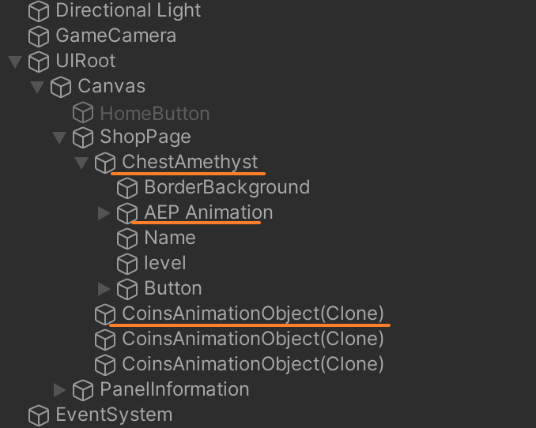
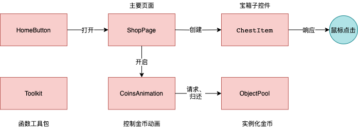

- Hierarchy结构具体如下：  

  1. `ChestAmesthyst`: 宝箱卡片
  2. `AEP Animation`: 宝箱开启的动画
  3. `CoinsAnimationObject`: 金币

- 项目共有1个prefeb, 在Hierarchy中的对应关系为：  
   1. 金币 --> `CoinsAnimationObject(Clone)`

- 代码共有3个类，关系与结构如下：  
  

  1. `ShopPage` 的功能包括： 
     - 创建宝箱UI  
     - 监控钻石、金币数量  
     - 开启金币动画
  2. `CoinsAnimation` 使用Dotween插件实现金币动画。