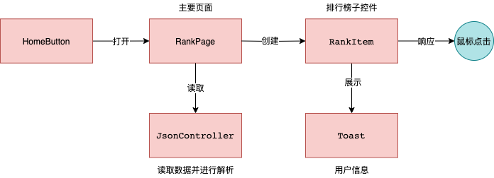

- Hierarchy结构具体如下：  

- 项目共有1个prefeb, UI的主要内容有：  
   1. `PanelRankItem` --> 排行榜的主要子控件  
   2. `PanelTitle` --> 包含顶部信息的Panel
   2. `PanelClose` --> 包含底部关闭按钮的Panel
   3. `PanelToast` --> 展示详细用户信息的Panel

- 代码共有5个类，主要的类是 `RankPage`和`RankItem` ：  
  

   - `RankPage` 的功能包括： 
      - 数据排序完成页面初始化
      - 创建页面子控件`RankItem`
      - 控制倒计时
   - `RankItem` 的功能包括： 
      - 记录信息，完成子控件的初始化
      - 响应鼠标事件，调用`Toast`