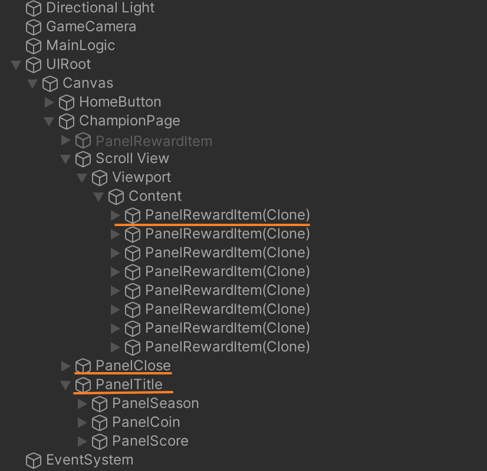
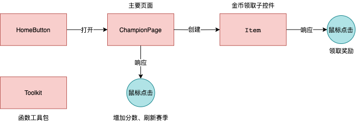

- Hierarchy结构具体如下：  

   1. `PanelRewardItem` --> 领取金币的主要子控件  
   2. `PanelTitle` --> 包含顶部信息的Panel
   3. `PanelClose` --> 包含底部关闭按钮的Panel

- 代码共有5个类，主要的类是 `ChampionPage`和`Item` ：  
  

   - `ChampionPage` 的功能包括： 
      - 完成页面初始化
      - 创建页面子控件`Item`
      - 响应增加分数、刷新赛季；并完成响应数据变化
   - `Item` 的功能包括： 
      - 记录信息，完成子控件的初始化
      - 响应鼠标事件，调用`ChampionPage`